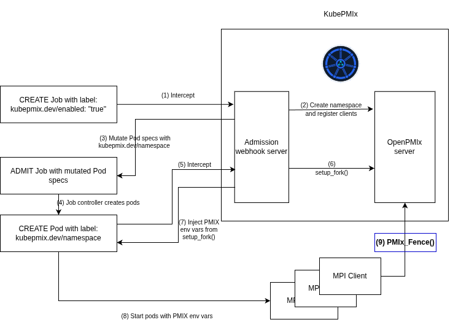

# KubePMIx - Architecture

### Overview

KubePMIx is fundamentally an OpenPMIx server, built from official [OpenPMIx Python bindings](https://github.com/openpmix/openpmix/tree/master/bindings), that is wrapped into [Kubernetes Admission Webhook server](https://kubernetes.io/docs/reference/access-authn-authz/extensible-admission-controllers/#experimenting-with-admission-webhooks). OpenPMIx namespaces and clients are dynamically registered in the OpenPMIx server, when properly labelled Job or JobSet resource is created on the Kubernetes cluster. Then, pods are mutated with PMIx environment variables generated with `setup_fork()`.

KubePMIx allows to run MPI client processes directly in the container entrypoints and does not require any launcher (No `sshd` and `mpirun`).

### Motivation

The main motivation of KubePMIx is to be able to run MPI Jobs on Kubernetes cluster, without relying on `mpirun`.

### Role OpenPMIx in MPI jobs

MPI is peer-to-peer at runtime — processes communicate with each other directly, without any intermediary proxy server. The one prerequisite this imposes is that every process must exchange its endpoint information with all peers, so that direct connections can be established.

For example, when MPI processes communicate over TCP (using the TCP Byte-Transfer-Layer), each peer needs to know the IP address and port of every other peer on the network.

When a peer process initializes itself in the MPI world (calls `MPI_Init()`), it invokes `PMIx_Fence()` underneath. The role of `PMIX_Fence()` is to publish local endpoint data to other peers and — more importantly — to **wait until all peers have published their endpoints**. This exchange happens through a central OpenPMIx server, which guarantees that all processes have committed their endpoints before any of them is allowed to proceed.

MPI process reads the OpenPMIx server data by reading env vars - `PMIX_SERVER_URI2`, `PMIX_NAMESPACE` and `PMIX_RANK` to initialize the OpenPMIx library and call `PMIx_Fence()`.

In the typical scenario, these env vars are injected by `mpirun` / `prterun`. `prterun` and look like this:

```
PMIX_SERVER_URI2=1856372736.0;tcp4://127.0.0.1:38221
PMIX_NAMESPACE=1839595521
PMIX_RANK=0
```

Indeed every MPI peer launched by `prterun` gets its own **local** OpenPMIx server (`prted`), accessible via `127.0.0.1`. `prted` is much more than just Fence - it also spawns and kills processes, streams logs and connects back to launcher via OOB connection. KubePMIx does not implement any of that (assuming this is handled by the container orchestrator).

For the MPI client itself, KubePMIx plays the same role that `prted` - it's a server that enables `PMIx_Fence()` to run. Every rank connects to the same server and considers this server as "local".

Besides MPI initialization (which uses Fence) - OpenPMIx server handles broadcasting events between ranks, which is critical for OpenMPI's User Level Failure Mitigation (ULFM). KubePMIx handles this seamlessly.

KubePMIx does not implement almost any logic of the OpenPMIx server - callbacks are handled by the OpenPMIx library via the Python bindings.

### Diagram

<p align="center">
  
</p>
